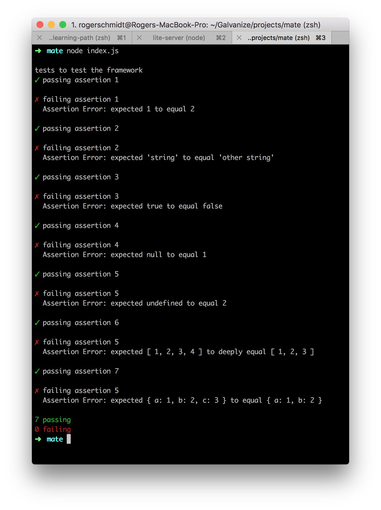

# Mate - a simple test framework

## To Do

Create a basic testing framework that uses an assertion library (like `chai`) to run tests on any given piece of synchronous code.

In the `mate.js` file, create the necessary code such that you export two functions `describe()` and `it()`. `describe` should be used as a way to create a block of tests, `it` should contain the test with an assertion.

When you are done, the report that is printed by running `node index.js` should look as follows



Make sure to read over the [Limitations](#limitations) below.

You can use a library named `chalk` to color the output in the terminal. Also, you can find the **checkmark** and **cross mark** by searching for their unicode number.

## To install

```
npm install
```

## To run

```
node index.js
```

## Limitations
There can only be one `describe` function, and they cannot be nested. This limitation is necessary because otherwise you'll need much more complicated tools to solve the problem.

An `it` function needs to contain an assertion, and cannot be nested.

## What assertion library do

An assertion library is a set of tools to check if to values, whether primitives or deeply nested reference types, are equal. They work by leveraging the `try catch` programming structure built into javascript.

```javascript
const { expect } = require('chai')
const AssertionError = require('assert').AssertionError;

try{
  expect(1).to.equal(2)
}
catch(e){
  console.log(e);
}
```

Will print out the following object

```javascript
{
  AssertionError: expected 1 to equal 2
    at Object.<anonymous> (/Users/rogerschmidt/Galvanize/projects/mate/index.js:4:16)
    at Module._compile (module.js:660:30)
    at Object.Module._extensions..js (module.js:671:10)
    at Module.load (module.js:573:32)
    at tryModuleLoad (module.js:513:12)
    at Function.Module._load (module.js:505:3)
    at Function.Module.runMain (module.js:701:10)
    at startup (bootstrap_node.js:193:16)
    at bootstrap_node.js:617:3
  message: 'expected 1 to equal 2',
  showDiff: true,
  actual: 1,
  expected: 2
}
```

The properties of this object that can be useful in reporting differences between expected and actual can be found in the argument that `catch` receives.

## Possible Solution

One way to solve this problem is located in the `solution` branch on this repo. If you need a few hints on how to get started, please take a look at it.

## Stretch goals
* Add pending tests (xdescribe, xit)
